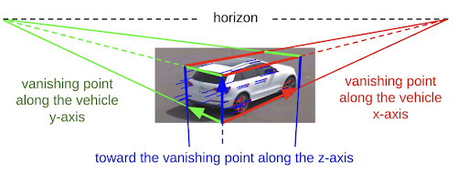
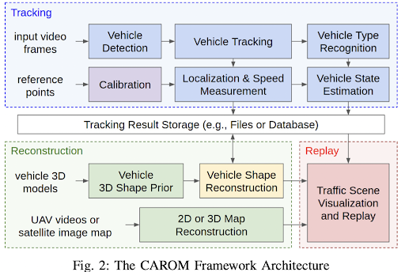
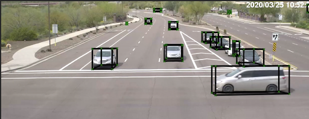

# Model-Based-Vehicle-Orientation-Estimation

### Project Statement and Formulation

* We aim to improvise a vehicle localization and traffic scene reconstruction framework using cameras - CAROM, i.e. “CARs On the Map”.
* The main objective of this project is to improve the vehicle tracking pipeline by leveraging the vehicle orientation estimation task.
* On achieving this, we will be able to decrease the rate of false predictions for vehicle instances.

### Project Approach

* CAROM framework uses sparse optical flow along with 2D bounding box predictions to estimate heading direction of an instance. We propose to change this by incorporating a deep learning based approach. 
* EgoNet is  a SOTA model for KITTI benchmark on vehicle orientation estimation task.
* The EgoNet integration will provide accurate 3D bounding boxes prediction for car instances in CAROM framework, resulting in better orientation estimation.

### intermediate outputs while integrating EgoNet with CAROM framework.

### Challenges

* At first, we tried making use of the Orientation Arrow from EgoNet as the heading direction in CAROM. This failed due to EgoNet’s dependency on D4LCN model for visualizing orientation arrow in image plane using ground truth 3D proposals. To resolve this problem, we tried out various combinations of 2D predicted key points to approximate the heading direction. Unfortunately, it didn’t yield outputs as expected.

* After getting suggestions from Varun, we shifted our focus to use the specific bbox endpoints from the predicted key points. In this approach, we use the key points directly in CAROM for obtaining 3D bounding boxes as shown in the demo. Following that, we faced lagging issue between frames and 3D bboxes. After fixing few bugs, it worked in a pretty decent manner ! 

* Lastly, it could be observed that there were frames when the bboxes for few car instances were flickering. We analyze this to be an issue of difference in system design of both EgoNet and CAROM. In CAROM, we have track of instances and the predictions are done on instances are previous frame predictions are also used for current frame. But in Egonet it works for a single image independently and thus there is no need for tracking instances b/w frames. 

* Nevertheless, we were able to see good amount of progress from other approaches and were successfully able to leverage CAROM framework with the use of EgoNet.

### References

* [1] Lu, Duo, et al. "CAROM-Vehicle Localization and Traffic Scene Reconstruction from Monocular Cameras on Road Infrastructures." 2021 IEEE International Conference on Robotics and Automation (ICRA). IEEE, 2021.
* [2] Li, Shichao, et al. "Exploring intermediate representation for monocular vehicle pose estimation." Proceedings of the IEEE/CVF Conference on Computer Vision and Pattern Recognition. 2021.
* [3] Geiger, Andreas, Philip Lenz, and Raquel Urtasun. "Are we ready for autonomous driving? the kitti vision benchmark suite." 2012 IEEE conference on computer vision and pattern recognition. IEEE, 2012.

